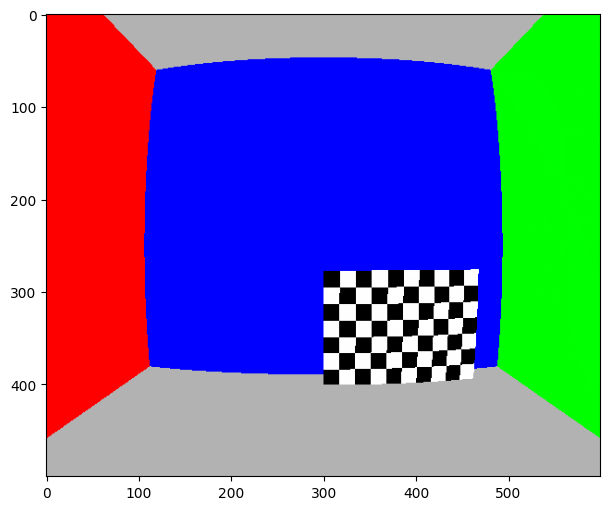
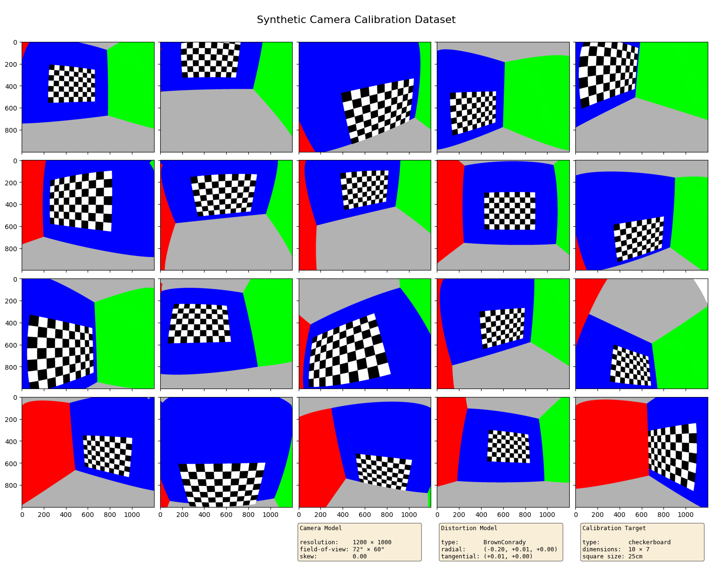
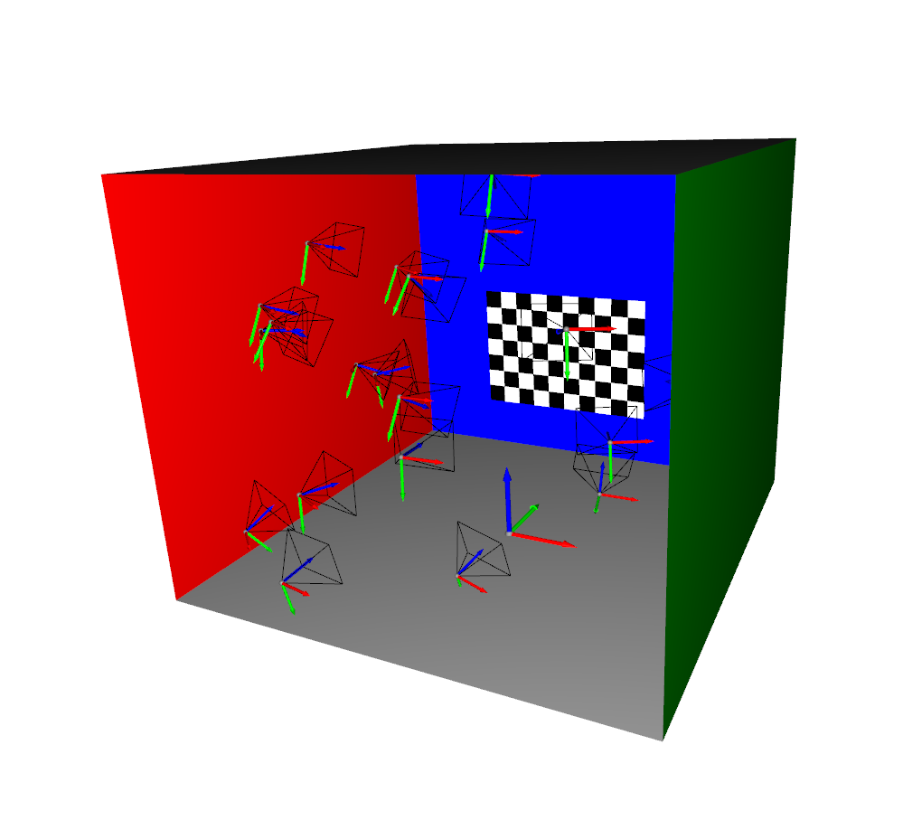

# PyCamCal

General-purpose camera calibration library

## Camera Models

Supported distortion model:
 - Radial-Tangential (aka Brown-Conrady)
 - Full OpenCV distortion parameters 🚧
 - Generalized warp-table 🚧

## Simulation

This library includes a minimal raycaster (built on top of Open3D) for geometrically-accurate simulated camera captures.

Using this engine we can prepare a scene containg a simulated calibration target and simulate a variety of captures using a provided camera model. The result is a camera calibration test dataset with known ground-truth reference.

